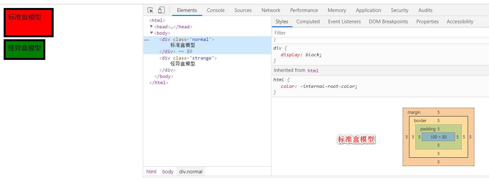
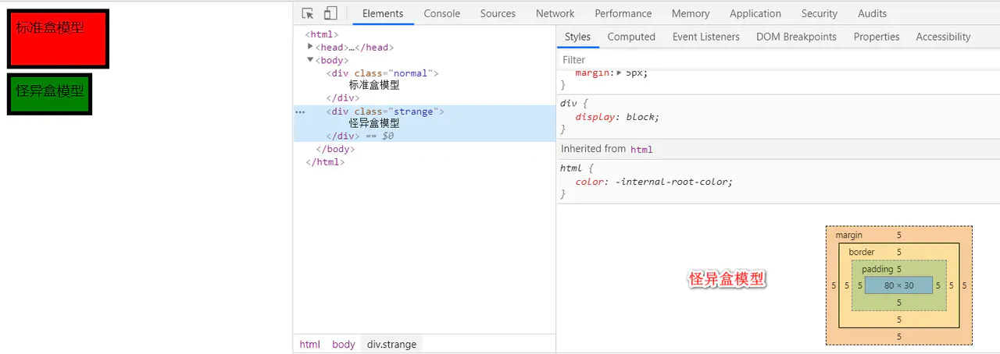

####  1、[html/css] [画一个盒模型]()

- 看透网页布局的本质

  >npy:网页布局中，我们是如何把里面的文字，图片，按照美工给我们的效果图排列的整齐有序呢？

  >Answer：首先利用CSS设置好盒子的大小，然后摆放盒子的位置，最后把网页元素如文字图片等等，放入盒子里面，当浏览器对文档进行布局的时候，渲染引擎将所有元素表现为一个个矩形的盒子，称为盒模型

- 盒子模型有哪几部分组成

  :construction_worker_man:从里到外：

  - 元素的内容(content)
  - 内边距(padding)
  - 边框(border)
  - 外边距(margin)

>盒子里面的文字和图片等元素是内容、盒子的厚度是盒子的边框、盒子内容与边框的距离是内边距、盒子与盒子之间的距离是外边距

- 标准盒模型和怪异盒模型

  标准和模型和怪异盒模型的区别是整个盒子的宽高决定方式的不同，可通过设置css属性box-sizing为content-box和border-box分别将盒子设置为标准盒模型和怪异盒模型。

- 哈?show me the code?


```html
<style>
    div {
        width:100px;
        height:50px;
        padding:5px;
        border:5px solid red;
        margin:5px
    }
    .normal {
        background:red;
    }
    .starnge {
        background:green;
        box-sizing:border-box;
    }
</style>
<div class="normal">
    标准盒模型
</div>
<div class="strange">
    怪异盒模型
</div>
```





- 盒子尺寸(元素实际大小)与盒子总宽高(在页面中占据的大小)---标准盒模型

  - 高度

    Element Height = content height + padding + border （Height为内容高度）

  - 宽度

    Element Width = content width + padding + border （Width为内容宽度）

    盒子的实际的大小 =   内容的宽度和高度 +  内边距   +  边框   

  - 在页面中占据的大小

    总宽度 = 内容的宽高+两侧内边距+两侧边框+两侧外边距

- 盒子尺寸(元素实际大小)与盒子总宽高(在页面中占据的大小)---怪异模型

  - 在页面中占据的大小

    总宽度 = 宽度（内容+边框+左右填充）+左右边距

    盒子的实际的大小 =   直接将宽/高属性设定为盒子自身的整体尺寸，如果带有内边距或边框，则通过缩小内容区域来实现

- 定义盒模型 属性 ：box-sizing

  box-sizing属性的三个值 ：

  1. content-box： 默认值，border和padding不算到width范围内，采用标准模式解析计算，是W3c的标准模型(default)
     - 即：设置的元素的height/width属性是指content的宽高
  2. border-box：border和padding划归到width范围内，采用怪异模式解析计算，是IE的怪异盒模型
     - 即：设置元素的height/width属性是指border+padding+content的宽高
  3. padding-box：已弃用

#### 2、 [js] [js有哪些基础类型]() 

-  原始数据类型

​       基本数据类型到目前为止一共有七种，分别是 `null, undefined, Number, String, Boolean, Symbol, BigInt` 。

存储于栈内存中，数据大小确定，按值存放，所以能够直接访问

- `null` 和 `undefined` 的区别

​       `null` 和 `unfined` 在 `if` 语句中都表示 `false`，由于它们极度相似，所以很容易被混淆。`null` 主要用来表示**空对象**，转换数值时为 0，原型链的终点就是 `null`；而 `undefined` 表示一个变量被声明但未被初始化，访问一个未被声明的变量也会得到 `undefined`，转换为数值时为 `NaN`。还有一个显著的区别就是 `typeof null` 返回 `“object”`，`typeof undefined` 返回 `“undefined”`。

- Symbol 相关

  Symbol 是新增的数据类型，表示唯一的值。Symbol 可以由 `Symbol()` 函数创建，不能使用 `new Symbol` 构造函数的形式创建 Symbol。 `Symbol` 的用途往往是作为某个对象属性的标识符，比如 `Symbol.hasInstance, Symbol.iterator` 。因为 Symbol 是唯一的，所以可以轻松的避免对象属性名冲突的问题。

```js
const symbol = Symbol('foo');

console.log(typeof symbol); // "symbol"
console.log(symbol.toString()); // "Symbol(foo)"
console.log(symbol === Symbol('foo')) // false
复制代码
```

还可以用 `Symbol.for()` 函数全局注册 Symbol，传入相同的字符串会返回同一个 Symbol

```js
const symbol = Symbol.for('CustomSymbol');
const symbol2 = Symbol.for('CustomSymbol');

console.log(symbol === symbol2); // true
复制代码
```

- BigInt 相关

在 JS 中，所有数字都以双精度64位浮点格式表示，这导致 Number 类型无法精确的表示一些非常大的整数，以前在处理大整数时往往需要借助第三方库。`BigInt` 是 JS 新的内置类型，用于表示整数值大于Number数据类型支持的范围的数。它的使用方式也十分简单，直接在数字后面加 `n` 或者调用 `BigInt` 函数。

```js
let a = 1007199254740991n;
let b = BigInt('1007199254740991');

console.log(a, b);
// Output: 1007199254740991n 1007199254740991n
复制代码
```

`BigInt` 目前还不是很成熟，除兼容性问题外，还有一些需要注意的点：

1. 不要与 `Number` 一起混用，比如 `1 + 2n` ，可能会出现问题

2. 不能将 `BigInt` 传给参数类型是 `Number` 的函数，比如：

   ```js
   Math.max(10n, 20n);
   // TypeError: Cannot convert a BigInt value to a number
   复制代码
   ```

   其实 1 和 2 都反映一个问题，`BigInt` 无法转换给 `Number`

- 0.1+0.2为什么不等于0.3？

这是一个很经典的问题，面试中也很容易被问到。直接的结论是：由于某些小数在转换为二进制时会出现无限循环 (0.2*2=0.4*2=0.8*2=0.6*2=0.2)，那么被截掉的多余位数必定会造成精度的损失，比如 `0.1 + 0.2` 的实际结果是 `0.300000000...004`。

-  类型判断

  - typeof

  对于原始类型，除了 `null` 返回的是 `object` ，其它都是返回类型对应字符串名；对于引用类型，除了函数返回的是 `function`，其它的均返回 `object` 。

  - instanceof

​       `instanceof` 是基于原型链的查询来判断某个对象是否“属于”某个类型。我们也可以通过 `Symbol.hasInstance` 来自定义 `instanceof` 的行为，详见 [Symbol.hasInstance-MDN](https://developer.mozilla.org/zh-CN/docs/Web/JavaScript/Reference/Global_Objects/Symbol/hasInstance)

```js
class Animal {
}
const tiger = new Animal();
console.log(tiger instanceof Animal);

class PrimitiveNum {
  static [Symbol.hasInstance](ins) {
    return typeof ins === 'number';
  }
}
console.log(777 instanceof PrimitiveNum);
// Output: true true
复制代码
```

- toString

对于引用类型的判断，在实际项目开发中我们用的更多的是 `Object` 对象原型上的 `toString` 方法

```js
function isPlainObject(obj) {
  return Object.prototype.toString.call(obj) === '[object Object]';
}
function isArray(obj) {
  return Object.prototype.toString.call(obj) === '[object Array]';
}

console.log(isPlainObject({}));
console.log(isArray([]));

// Output: true true
复制代码
```

- 类型转换

  转换为String类型

  1.`toString()`方法。（基础数据类型本身没有该方法，但会通过原型链去找原型对象中的方法）

  ```
  const a = 123
  console.log(a.toString()) // '123'
  
  const b = true
  console.log(b.toString()) // 'true'
  
  const c = Symbol()
  console.log(c.toString()) // 'Symbol()'
  
  const d = null
  console.log(d.toString()) // TypeError: Cannot read property 'toString' of null
  
  const e = undefined
  console.log(e.toString()) // TypeError: Cannot read property 'toString' of undefined
  
  const f = [1, 2, 3]
  console.log(f.toString()) // '1,2,3'
  
  const g = { a: 123 }
  console.log(g.toString()) // [object Object]
  复制代码
  ```

  2.`String()`函数强制转换。（与`toString()`方法的区别就是可以转换`undefined`和`null`）

  ```
  const a = 123
  console.log(String(a)) // '123'
  
  const b = true
  console.log(String(b)) // 'true'
  
  const c = Symbol()
  console.log(String(c)) // 'Symbol()'
  
  const d = null
  console.log(String(d)) // 'null'
  
  const e = undefined
  console.log(String(e)) // 'undefined'
  
  const f = [1, 2, 3]
  console.log(String(f)) // '1,2,3'
  
  const g = { a: 123 }
  console.log(String(g)) // [object Object]
  复制代码
  ```

  3.隐式转换。（当`+`运算符的一侧为String类型的时候，在运算的过程就会把其它类型隐式的转换为String类型）

  ```
  console.log('hello:' + 123) // 'hello:123'
  console.log('hello:' + true) // 'hello:true'
  console.log('hello:' + undefined) // 'hello:undefined'
  console.log('hello:' + null) // 'hello:null'
  console.log('hello:' + [1, 2, 3]) // 'hello:1,2,3'
  console.log('hello:' + { a: 123 }) // 'hello:[object Object]'
  复制代码
  ```

  转换为Number类型

  1.`Number()`函数强制转换。（正常数字形式的字符串、布尔类型、null可以转换成功,其它转换失败的情况下都是`NaN`）

  ```
  console.log(Number('123')) // 123
  console.log(Number(true)) // 1
  console.log(Number(false)) // 0
  console.log(Number(null)) // 0
  console.log(Number(undefined)) // NaN
  console.log(Number('123a')) // NaN
  复制代码
  ```

  2.隐式转换。（当`-`运算符的一侧为Number类型的时）

  ```
  console.log('12' - 1) // 11
  console.log(12 - '1') // 11
  复制代码
  ```

  转换为Boolean类型

  1.`Boolean()`函数强制转换。（`''`、`0`、`undefined`、`null`、`NaN`转换结果为false，其余情况都是true）

  ```
  console.log(Boolean('')) // false
  console.log(Boolean(0)) // false
  console.log(Boolean(undefined)) // false
  console.log(Boolean(null)) // false
  console.log(Boolean(NaN)) // false
  复制代码
  ```

  2.隐式转换。（条件判断中会转换成布尔类型，但要注意下`==`和`===`的区别）

  ```
  console.log(1 == true) // true
  console.log(1 === true) // false
  复制代码
  ```

- - == 和 === 的区别

`==` 运算符是一种相似比较，也就是说比较过程中会发生类型转换。原始类型与原始类型会被转化为 `Number` 类型后再进行比较；而引用类型与原始类型比较时，引用类型会先被转化为原始类型。`===` 就是严格相等，值和类型都相同时才会返回 `true` 。

转化规则：

- 两边的类型是否相同，相同的话就比较值的大小，例如1==2，返回false
- 判断的是否是 `null` 和 `undefined`
- 判断的类型是否是String和Number，是的话，把String类型转换成Number，再进行比较
- 判断其中一方是否是Boolean，是的话就把Boolean转换成Number，再进行比较
- 如果其中一方为Object，且另一方为String、Number或者Symbol，会将Object转换成字符串，再进行比较

```js
console.log([] == ![]); // true([]会被转化为0)
console.log(NaN == NaN); // false
复制代码
```

- 引用类型

  `Object`、 `Array`、 `Function`、 `Date`、 `RegExp`

  存储于堆内存中，数据大小不确定，变量保存的是堆内存中的指针，该指针指向的是堆内存中存放的数据地址

  值是可变的 

- 对象属性

  对象属性特征

在对象中，我们一般可以通过两种方式访问或者定义属性：`.` 操作符和 `[]` 操作符。需要注意的是：对象中，属性名永远都是字符串，如果使用 `string` 字面量以外的类型作为属性名，那么 JS 会先将其转化为字符串。

```js
var obj = {};

obj[0] = 'zero';
obj[true] = 'true'
obj[obj] = 'object'

console.log(obj['0'], obj['true'], obj['[object Object]'])
// Output: zero true object
复制代码
```

- 属性描述符

除了使用  `.` 和 `[]` 给对象添加属性外，我们还可以使用 `Object.defineProperty()` 方法。

```js
var obj = {
  a: 2
};

console.log(Object.getOwnPropertyDescriptor(obj, 'a'));
// Ouput: 
// { value: 2, writable: true, enumerable: true, configurable: true }
复制代码
```

属性的四个特性分别对应着 `属性值`、`可写`、`可枚举`、`可配置`。这里解释一下可配置的意思，如果你将属性 `a` 的 `configurable` 设置为 `false`，那么你就不可以再用 `defineProperty` 方法设置该属性的特性值，无法删除该属性，同理也不可以设置 `configurable` 为 `true`，所以这是一个不可逆的操作。

这里还要提一下属性特性的默认值，如果我们用 `.` 或者 `[]` 操作符直接设置对象属性，那么 `enumerable, writable, configurable` 都默认为 `true`，而使用 `Object.defineProperty()` 方法定义属性时，注意是定义，这三个特性的默认值都为 `false` 。

```js
let obj = {};
obj.a = 1;
Object.defineProperty(obj, 'b', {
  value: 2,
});

console.log(Object.getOwnPropertyDescriptor(obj, 'a'));
// { value: 1, writable: true, enumerable: true, configurable: true }
console.log(Object.getOwnPropertyDescriptor(obj, 'b'));
// { value: 1, writable: false, enumerable: false, configurable: false }
复制代码
```

- 访问描述符

当给一个属性定义 `getter` 或者 `setter` 时，就给这个属性定义了 `访问描述符`，访问描述符会忽略 `value` 和 `writable` 特性，访问属性时会默认执行相应的 `getter` 和 `setter` 方法。

```js
var obj = {}
Object.defineProperty(obj, 'a', {
  get: function() {
    return this._a * 2;
  },
  set: function(val) {
    this._a = val;
  }
});
obj.a = 2;

console.log(obj.a)
// Output: 4
复制代码
```

我们还可以直接在对象文字语法中显式的定义 `getter` 和 `setter`

```js
var obj = {
  get a() {
    return 2;
  }
}
obj.a = 3;

console.log(obj.a);
// Output: 2
复制代码
```

- 属性不可变性
  - 常量

我们将属性的 `configurable` 和 `writable` 特性都设置为 `false`，就可以得到一个常量属性 (不可修改，不可删除，不可重定义)

- 禁止扩展

如果要禁止对象添加新的属性，可以使用 `Object.preventExtensions()` 方法

```js
var obj = {
  a: 1
};
Object.preventExtensions(obj);
obj.b = 2;

console.log(obj.b);
// Output: undefined
复制代码
```

- 对象属性遍历
  - for...in

`for-in` 循环可以遍历对象的可枚举属性列表，**包括了原型链中的属性**。`in` 操作符也可以单独使用来判断对象是否拥有某个属性，也会搜索对象的原型链；相对应的 `Object.prototype.hasOwnProperty()` 方法不会搜索原型链，可以判断对象是否实际拥有某个属性。

- Object.keys()

获取对象**可枚举**属性列表，不会搜索原型链。

- Object.getOwnPropertyNames()

获取对象**所有**属性列表，无论是否可枚举，但不会搜索原型链。

```js
function Father() {
  this.a = 1;
}

Father.prototype.b = 2;

var son = new Father();

Object.defineProperty(son, 'c', {
  value: 3,
  configurable: true,
  enumerable: false,
  writable: true
});

for (var key in son) {
  console.log(son[key]);
}

console.log('b' in son);
console.log(son.hasOwnProperty('b'))

console.log(Object.keys(son));
// Output: ['a']
console.log(Object.getOwnPropertyNames(son));
// Output: ['a', 'c']
复制代码
```

####  3、[计算机网络] [osi七层模型]() 

七层模型主要分为：(物联网淑慧试用)

每一层都向上层提供服务，并接受下层的服务，越向下越面向底层，越向上越面向用户。

| OSI七层模型             | TCP/IP四层模型                       | 对应网络协议                            |
| ----------------------- | ------------------------------------ | --------------------------------------- |
| 应用层（Application）   | 应用层                               | HTTP、TFTP, FTP, NFS, WAIS、SMTP        |
| 表示层（Presentation）  | Telnet, Rlogin, SNMP, Gopher         |                                         |
| 会话层（Session）       | SMTP, DNS                            |                                         |
| 传输层（Transport）     | 传输层                               | TCP, UDP                                |
| 网络层（Network）       | 网络层                               | IP, ICMP, ARP, RARP, AKP, UUCP          |
| 数据链路层（Data Link） | 数据链路层                           | FDDI, Ethernet, Arpanet, PDN, SLIP, PPP |
| 物理层（Physical）      | IEEE 802.1A, IEEE 802.2到IEEE 802.11 |                                         |

看完之后，是不是觉得七层模型和四层模型也就这么多东西，没什么可讲的呢？

**1.物理层**

首先我们来看一下物理层，物理层是做什么的？网上资料如下：

主要定义物理设备的标准，比如网线的接口类型，光纤的接口类型，各种传输介质的传输速率等，它的主要作用就是传输比特流（就是由1 0 转换为电流的强弱类进行传输，到大目的地后在转换为 1 0 就是通常我们说的数模转换和模数转换）这一层的数据叫做比特。

看完网上的资料是不是一脸懵逼，没关系，我们用白话解释一下。

物理层说白了就是怎么让电脑之间联网。比如插根网线、连接wifi、光缆等等方式。我们就理解成物理层负责怎么把电脑连接起来，形成一个网络，就完事了。它传输的是计算机最底层的0 1信号，学过计算机或者电子的应该都清楚0 1信号。

**2.数据链路层**

我们还是看一下网上的资料：

主要将物理层接受的数据进行MAC地址（网卡地址）的封装与解除封装。常把这一层的数据叫做帧。在这一层工作的设备叫做交换机，数据通过交换机来传输。

解析：

我们知道物理层把各个电脑连接起来了，互相之间发送0 1电路信号，那是不是得知道这些0 1信号代表啥意思？数据链路层就是翻译这个的。

以前，每个公司会定义自己的电路信号分组方式，后来出现了以太网。一组电信号就是一个数据包，也就是帧（frame），它分为两部分，标头（head）和数据(data)，标头里一般会放一些说明的东西，比如发送者、接收者和数据类型等等。

那么数据包中是如何确定发送者位置的呢？

以太网规定每个网卡必须包含一个mac地址，mac地址就是这个网卡的身份证。接入网络的所有设备都得有网卡，数据包中就是通过mac地址进行网卡定位的。每块网卡出厂时就有一个唯一的mac地址。48位的二进制，但是一般用12个16进制数字表示，前6个16进制是厂商编号，后6个16进制是网卡流水号。

那么以太网的数据包是怎么从一个mac地址发送到另一个mac地址的呢？这个其实不是点对点的，而是会广播给局域网内的所有网卡，然后每个网卡会从数据包中获取接收者的mac地址进行比对，如果相同就说明是给自己的数据包。

当然这种广播的方式只针对于局域网。

**3.网络层**

网上资料：

主要从下层接受到的数据进行IP地址（192.168.0.1）的封装与解封装。在这一层工作的设备是路由器。把这一次的数据叫做数据包。

解析：

网络层是一个比较复杂的部分，上边我们介绍了局域网内发送数据包是通过广播的方式发送的，那么怎么来确定哪些电脑在一个子网内呢？这就要靠网络层了，于是引入了IP地址，它就可以区分出哪些电脑在一个子网。

网络层有IP协议，定义的地址就叫IP地址，分为IPv4和IPv6，目前我们一般使用的都是IPv4，由32个二进制数字组成，但是一般用4个十进制表示，范围从0.0.0.0到255.255.255.255。

每台计算机都会被分配到一个IP地址，前24位（也就是十进制的前三个）代表网络，后8为（十进制的最后一个）代表主机。

**如果几台电脑在一个子网，那么前三个十进制数一定是一样的。**

而实际上不单单是通过ip地址进行判断的，还需要ip地址配合子网掩码一起判断。

比如两个地址192.168.1.3和192.168.2.5，判断是否是一个子网，首先会分别与子网掩码255.255.255.0进行二进制的与运算，然后对比网络部分的数字是不是一样的。

那么如果发现不在一个子网了，要怎么传输信息呢？

这个时候就需要路由来发送数据包了。

说到路由一定会想到我们平时使用的路由器，家里的路由器其实连接的就是你自己家里的一个子网，如果你要访问外网的时候，其实是跟那个网站机器所在的子网进行通信的。

路由器其实就是配置了多个网卡的专用设备，可以通过不同网卡接入不同的网络。而网关就是路由器的一种，我们可以认为路由器的ip地址就是网关地址，路由器上每个网卡都有ip地址和mac地址，但只能通过ip寻址，不能通过mac寻址。

那网络交换机又是什么呢？它也是一种设备，是工作在数据链路层的，是通过mac地址寻址和传输数据的。网络交换机主要用在局域网的通信，通过mac地址进行广播通信。而路由器一般是用来让你连接外网的。

**顺便我们再介绍几个概念作为扩展。**

LAN，就是local area network，就是局域网；WAN，就是wide are network，就是广域网。WLAN是wireless local area network，就是无线局域网，也就是wifi。

家里的路由器是包含交换机和路由两个功能的，如果连接到局域网内的设备就把网线插入LAN接口，如果连接外网就把网线插入WAN接口。

**那么路由器访问外网的过程是怎么样的呢？**

举个例子，两个局域网之间如何通过一个路由器进行通信。

大概过程就是，路由器配置了两个网卡，每个网卡可连接到一个局域网内。

局域网1内的电脑想发送数据到局域网2内的电脑，在数据包中会写上自己的ip地址和对方的ip地址。但是他们不在一个局域网内，于是局域网1的电脑先通过交换机将数据包发送给路由器，这个过程需要将路由器的一块网卡的ip地址对应的mac地址写到数据包的头部，然后才能通过交换机广播出去，发送给路由器。

接着路由器接到数据包，就会在局域网2内将目标机器的ip地址对应的mac地址写入头部，然后通过局域网2的交换机发送给局域网2内的电脑。

**4.传输层**

网上资料：

定义了一些传输数据的协议和端口号（www端口 80等）,如：TCP（传输控制协议。传输效率较低，可靠性强，用于传输可靠性要求高数据量大的数据），UDP（用户数据报协议，与TCP相反，用户传输可靠性要求低，数据量较少的数据，如QQ聊天就是通过UDP传输的）主要从下层接收的数据进行分段和传输，到大目的地后再重组。

解释：

上边我们已经了解了网络层的通信流程，但还有个问题，就是机器上很多的程序都在使用一个网卡进行网络通信，那么怎么区分是哪个程序的数据呢？

这时候就引入了端口号的概念，就是发送的数据包其实是到网卡的某个端口上去的，然后那台机器上监听这个端口的程序就可以提取发送到这个端口的数据了。

端口号范围是0-65536,0-1023被系统占用了，其他应用程序用的是1024以上的端口。

所以小伙伴们会发现，网络层是基于ip协议进行主机之间寻址和通信的，然后传输层其实是建立主机的某个端口到另一个主机的端口之间的连接和通信的。

udp和tcp都是传输层的协议，作用就是在数据包里加入端口号，进行点对点通信。

udp是不可靠的，发出去人家收到没有就不知道了；tcp是可靠的，要求三次握手确认，接收到消息必须回复。

tcp协议仅仅规定了一套基于端口的点对点通信协议，包括如何建立连接，如何发送和读取消息，实际开发一般使用的就是socket网络编程了。

说到这里相信小伙伴们对与socket网络编程的原理也就有了一个更深层的了解了。

**5.应用层**

网上资料：

会话层：通过传输层（端口号：传输端口与接受端口）建立数据传送的通路。主要在你的系统之间发起会话或者接收会话请求（设备之间需要互相认识可以是IP也可以使MAC地址或者主机名）

表示层：主要是对接收的数据进行解释 加密与解密压缩与解压缩等（也就是把计算机能够识别的东西转换成人能识别的东西，图片声音等）

应用层：主要是终端应用，比如说是FTP（各种文件下载），web浏览器，QQ（可以理解成我们在电脑上可以直接看到的东西就是终端应用）

解释：

在四层模型中，应用层包含了会话层、表示层、应用层。所以我们就放在一起解释了。应用层中最常见的协议就是http协议。

####  4、[操作系统] [进程和线程的区别]()

> 为了帮助大家理解什么是进程，以厨师做蛋糕为例。厨师做蛋糕，首先需要厨师（CPU），其次，需要食谱（程序）和原料(输入数据)，而用原料做蛋糕的一些列动作的总和就是进程。某天厨师正在后厨做着蛋糕，突来听到儿子哭着跑进后厨，说自己被蜜蜂蛰了  ，厨师放下手中工具，并记录下当前做到哪一步了（保存上下文信息）  ，然后拿出急救手册，按其中的说明为儿子进行处理（开始另外一个进程）。

首先你要理解cpu的概念，计算机上的所有操作都是由cpu来执行的，cpu将要执行的操作分为一个个的任务，这些任务我们就可以理解为**进程**，而这些任务又分为一些细粒度更小的子任务，这些子任务就称作**线程**

cpu轮流执行任务的，每一个任务需要经过以下三个阶段：

- 加载上下文
- 执行
- 保存上下文

也就是说，每一个进程从加载、执行，到切换下一个进程执行，都会经历同样的一个过程，我们的cpu就是在无时无刻地进行这样的进程切换操作

而我们又可以把进程分为一些细粒度更小的线程，这些线程之间也可以来回的切换，就像进程一样，但是却不需要加载和保存上下文的操作，因为这些线程都是共享上下文的

- 进程与线程的区别

>一个程序就是一个进程，而一个程序中的多个任务则被称为线程。 进程就像是一家工厂，多个工厂之间是独立存在的。而线程就像是工厂中的那些工人，共享资源，完成同一个大目标。


多线程可以并行处理任务，但是**线程是不能单独存在的，它是由进程来启动和管理的**。那什么又是进程呢？

**一个进程就是一个程序的运行实例**。详细解释就是，启动一个程序的时候，操作系统会为该程序创建一块内存，用来存放代码、运行中的数据和一个执行任务的主线程，我们把这样的一个运行环境叫**进程**。

这里为大家简单总结了一些进程和线程的区别，如有错误欢迎指正：

- **性质不同**：进程是资源分配的基本单位，线程是cpu执行运算和调度的基本单位
- **归属不同**：一个操作系统中可以有很多进程，一个进程可以有很多线程
- **开销不同**：进程创建、销毁和切换的开销都要远大于线程
- **拥有资源不同**：每个进程都拥有自己的内存和资源，一个进程中的线程会共享这些内存和资源
- **通信方式不同**：进程之间可以通过管道、消息队列、共享内存、信号量，以及Socket等机制实现通信，线程之间主要通过共享变量及其变种形式实现通信
- **控制和影响能力不同**：子进程无法控制父进程，一个进程发生异常时一般不会影响其他进程；子线程可以控制父线程，如果主线程发生异常，会影响其所在进程和其余线程
- **扩展能力不同**：多进程可以方便地扩展到多机分布式系统上，多线程想要扩展到多台机器上就很困难
- **cpu利用率不同**：进程的cpu利用率低，因为需要额外的上下文切换开销；线程的cpu利用率高，因为切换简单
- **可靠性不同**：进程的可靠性要高于线程

####  5、[Vue] Vue的父子组件如何通信

- 总结Vue组件的通信

1、props/$emit

最常用的一种父子间传递数据的方式。

描述：

父组件通过绑定属性来向子组件传递数据，子组件通过 **props** 属性来获取对应的数据；子组件通过 **$emit** 事件向父组件发送消息，将自己的数据传递给父组件。

使用方法：

```
// 父组件compA
<template>
    <div>
        <compB
        :title="value"
        :moreBtn="moreBtn"
        @more="onMore"/>
    </div>
    
</template>
<script>
import compB from './compB'
export default{
    name: 'compA',
    components:{
        compB
    },
    data(){
        return {
            value: '',
            moreBtn: true
        }
    },
    method:{
        onMore(value){
            console.log('value', value)
            //点击查看更多按钮
        }
    }
}
</script>
复制代码
//子组件compB
<template>
    <div>
        <div class="title">{{value}}</div>
        <div v-if="moreBtn" @click="handleMore">查看更多</div>
    </div>
</template>
<script>
export default{
    name: 'compB',
    data(){
        return {
        }
    },
    props: {
        title: {
            type: String,
            default: '标题'
        },
        moreBtn: {
            type: Boolean,
            default: false
        }
    }
    method:{
        handleMore(){
            this.$emit('more', '点击查看更多按钮')
        }
    }
}
</script>
复制代码
```

props使得父子之间形成一种单向数据流，父元素更新的时候，子元素的状态也会随之改变。但反之会导致你的应用的数据流向难以理解。

> 注意在 JavaScript 中对象和数组是通过引用传入的，所以对于一个数组或对象类型的 prop 来说，在子组件中改变这个对象或数组本身将会影响到父组件的状态。

如果通过prop传递的数据是数组或者是对象，则是可以改变父对象的值，但是不推荐。如果传递的是个字符串，还要改变父组件的值，那么Vue 会在浏览器的控制台中发出警告。

在某些情况下，需要子组件改变父组件的值，推荐使用(2.3.0+)版本新增的.sync语法糖。

使用方法：

```
// A.vue
<template>
    <add-modal 
      v-if="modalVisiable" 
      :visiable.sync='modalVisiable' 
      @submit="saveForm"
    />
</template>
<script>
export default {
    name: 'A',
    data(){
        return {
            modalVisiable: false
        }
    }
}
</script>
复制代码
// B.vue
<template>
    <Modal 
      v-model="show"
      width="600"
      title="弹框" 
      :loading='true'
      @on-cancel="$emit('update:visiable', false)"
    >
    </Modal>
</template>
<script>
export default {
    name: 'A',
    data(){
        return {
            show: false,
        }
    },
    created(){
        this.show = this.visiable
    },
    props: {
        visiable: {
          type: Boolean,
          default: false
        }
    },
}
</script>
复制代码
```

通过 **this.$emit('update:visiable', false)** 来改变父元素的状态

2、$emit/$on

eventBus事件总线

描述：

这个方法是通过创建一个空的 vue 实例，当做 $emit 事件的处理中心（事件总线），通过他来触发以及监听事件，方便的实现了任意组件间的通信，包含父子，兄弟，隔代组件。

以下图为例，我们要实现的是A组件和C组件向B组件传输数据。


使用方法：

```
<!--home.vue-->
<template>
  <div>
    <div>我是父元素，我的num的值是：{{num}}</div>
    <a-comp :event="bus" :num.sync='num'></a-comp>
    <c-comp :event="bus" :num='num'></c-comp>
    <b-comp :event="bus"></b-comp>
  </div>
</template>
<script>
import Vue from 'vue';
import aComp from './a.vue';
import bComp from './b.vue';
import cComp from './c.vue';
// 创建一个空的vue实例
const bus = new Vue();
export default {
  'name': 'example',
  data() {
    return {
      bus,
      'num': 1
    };
  },
  'components': {
    aComp,
    bComp,
    cComp
  }
};
</script>
复制代码
<!--a.vue-->
<template>
  <div class="a-content">
    我是组件A，
    <el-button type="primary" @click="send">点击我向B发送东西</el-button>
  </div>
</template>
<script>
export default {
  'name': 'aComp',
  'props': [
    'event',
    'num'
  ],
  data() {
    return {'nb': 0};
  },
  created() {
    this.nb = this.num;
  },
  'methods': {
    send() {
      this.nb = this.nb + 1;
      this.$emit('update:num', this.nb);
      // 通过$emit 来触发phone-a事件
      this.event.$emit('phone-a', '我是组件A啊', this.nb);
    }
  }
};
</script>
复制代码
<!--c.vue-->
<template>
  <div>
    我是组件C，
    <el-button type="primary" @click="send">点击我向B发送东西</el-button>
  </div>
</template>
<script>
export default {
  'name': 'cComp',
  'props': [
    'event',
    'num'
  ],
  data() {
    return {};
  },
  'methods': {
    send() {
      console.log(this.num);
      this.event.$emit('phone-c', `我是组件C啊${this.num}`);
    }
  }
};
</script>
复制代码
<!--b.vue-->
<template>
  <div class="b-content">
    <div>我是组件B，我会接收组件A及组件C</div>
    <div>
      A: {{a}}
    </div>
    <div>
      B: {{c}}
    </div>
  </div>
</template>
<script>
export default {
  'name': 'bComp',
  data() {
    return {
      'a': '',
      'c': ''
    };
  },
  'props': ['event'],
  mounted() {
    // 通过$on来监听 phone-a 、phone-c 事件
    this.event.$on('phone-a', (a, num) => {
      this.a = `${a},我在改变父元素传过来的值num: ${num}`;
    });
    this.event.$on('phone-c', c => {
      this.c = c;
    });
  }
};
</script>
复制代码
```

其中最重要的是他们必须要在公共的实例中才能实现数据的互相传递。

3、provide / inject

描述：

这对选项需要一起使用，父组件使用 provide 向下提供数据，其下所有子组件都可以通过inject注入。不管中间隔了多少代，都可以注入多个来自不同父级提供的数据

- provide 选项是一个对象或返回一个对象的函数。该对象包含可注入其子孙的属性
- inject 选项是一个字符串数组，或一个对象

使用方法：

```
// 父组件
<template>
  <div>
    <com-a></com-a>
  </div>
</template>
<script>
import ComA from './a';

export default {
  'name': 'home',
  'components': {ComA},
  provide() {
    return {
      'a': 'Hello',
      'show': val => !val
    };
  }
};
</script>

复制代码
// 子组件
<template>
  <div>
    <el-button @click="showFn(textShow)">点击我切换下面文字展示及隐藏</el-button>
    <div v-if="textShow">我是一段随意被操控的文字{{a}}</div>
  </div>
</template>
<script>
export default {
  'name': 'ComA',
  data() {
    return {'textShow': true};
  },
  'inject': [
    'a',
    'show'
  ],
  'methods': {
    showFn(val) {
      this.textShow = this.show(val);
    }
  }
};
</script>
复制代码
```

如果是在app.vue 文件（根文件）里面全局注册信息，就可以在整个路由里面去引用 （类似于全局的数据管理vuex）

```
<template>
    <div>
        <router-view></router-view>
    </div>
</template>
<script>
export default {
    name: 'app',
    provide(){
        return {
            app: this
        }
    }
}
</script>
复制代码
```

接下来任何组件只要通过inject注入app的话，都可以直接通过this.app.xx 来访问app.vue 的所有实例。

4、$parent / $children

描述：

$parent 可以用来从一个子组件访问父组件的实例。它提供了一种机会，可以在后期随时触达父级组件，来替代将数据以 prop 的方式传入子组件的方式

```
<template>
  <div class="b-content">
    <div>我是子组件</div>
    <span>{{msgText}}</span>
  </div>
</template>
<script>
export default {
  'name': 'childComp',
  data() {
    return {
      'msgText': '',
      'childMsg': '来自子元素的呐喊'
    };
  },
  created() {
    this.msgText = this.$parent.parentMsg;
    // MsgText: 来自父组件的呵呵
  }
};
</script>
复制代码
```

$children可以遍历全部子组件，需要注意 $children 并不保证顺序，也不是响应式的。

```
<template>
  <div class="b-content">
    <div>我是父组件</div>
    <child-comp></child-comp>
  </div>
</template>
<script>
import childComp from './child';

export default {
  'name': 'parentComp',
  data() {
    return {'parentMsg': '来自父组件的呵呵'};
  },
  'components': {childComp},
  mounted() {
    // 读取子组件数据，注意$children子组件的排序是不安全的
    console.log(this.$children[0].childMsg);
    // 来自子元素的呐喊
  }
};
</script>
复制代码
```

5、$root & refs

描述：

$root 属性是在每个 new Vue 实例的子组件中，其根实例可以通过 $root 属性进行访问。例如，在这个根实例中：

```
// Vue 根实例
new Vue({
  data: {
    foo: 1
  },
  computed: {
    bar: function () { /* ... */ }
  },
  methods: {
    baz: function () { /* ... */ }
  }
})
复制代码
```

所有的子组件都可以将这个实例作为一个全局 store 来访问或使用。

```
// 获取根组件的数据
this.$root.foo

// 写入根组件的数据
this.$root.foo = 2

// 访问根组件的计算属性
this.$root.bar

// 调用根组件的方法
this.$root.baz()
复制代码
```

$refs属性当你需要在 JavaScript 里直接访问一个子组件。你可以通过 ref 这个 attribute 为子组件赋予一个 ID 引用。 一个对象，持有注册过 ref 特性 的所有 DOM 元素和组件实例。例如：

```
<my-component ref="childrenCompA"></my-component>
复制代码
访问子组件：this.$refs.childrenCompA
复制代码
```

6、Vuex

在做中大型的单页应用的时候，例如需要多人协作开发，全局维护登录状态等，我们可以选择vuex来进行状态管理。

> state里面是存储在vuex里的数据，通过在根实例中注册 store 选项，该 store 实例会注入到根组件下的所有子组件中，且子组件能通过 this.$store 访问到。

当需要获取多个数据时，可以通过下面这种方式：

```
import {mapState} from 'vuex'
computed:{
    ...mapState('commissionSetting', [
      'listData'
    ])
},
复制代码
```

不是所有的状态都适合放在vuex里面，有些状态只属于单个组件，所以还是要视情况来定。

> mutations 更改 Vuex 的 store 中的状态的唯一方法是提交 mutation

```
const mutations = {
  updateListData(state, payload){
    state.listData = payload
  }
}
复制代码
```

不能直接调用updateListData，需要以相应的 type 调用 store.commit 方法：

```
store.commit('updateListData', data)
复制代码
```

> actions 提交的是 mutation，而不是直接变更状态。 Action 可以包含任意异步操作。

写一个简单的action:

```
async getListAction({commit}, params){
    const result = await getList(params)
    const {code, message, data} = result
    if(code === SUCCESS && data){
      // 提交更改数据
      commit('updateListData', data.rows)
    }else{
      vueInit.$Message.error({
        content: message || '请您稍后再试~'
      });
    }
    return result
  },
复制代码
```

Vuex 并不限制你的代码结构。但是，它规定了一些需要遵守的规则：

- 应用层级的状态应该集中到单个 store 对象中。
- 提交 mutation 是更改状态的唯一方法，并且这个过程是同步的。
- 异步逻辑都应该封装到 action 里面。

只要你遵守以上规则，如何组织代码随你便。如果你的 store 文件太大，只需将 action、mutation 和 getter 分割到单独的文件。

####  6、[浏览器/Nodejs/Webpack] [同源的定义]()

- 同源策略

为保护用户信息安全，防止恶意网站窃取用户数据，浏览器限制本域中的脚本只能访问本域中的资源，这就是同源策略。

- 同源的定义

如果两个 URL 的 `protocol`、`host`、`port` 三者都相同的话，则这两个 URL 是同源，即属于同一个域。

- 源的继承

在页面中通过 `about:blank` 或 `javascript: URL` 执行的脚本会继承打开该 URL 的文档的源，因为这些类型的 URL 没有包含源服务器的相关信息。

- 源的修改

可以通过设置 `document.domain` 为当前域或者当前域的父域来修改当前页面的源。 由于设置 `document.domain` 会导致 `port` 被重置为 `null`，所以使用这种方式修改源时，需要在父域和子域中设置 `document.domain` 为相同的值，否则会由于 `port` 不相同而无法通过同源检测。

####  +1、[数据结构/算法] [用js描述一棵树,并非递归遍历该树]()  

- 树是什么
  - 一种`分层`数据的抽象模型
  - 前端工作中常见的树包括：`DOM`树,级联选择,树形控件
  - `JS`没有树,但是可以用`object`和`Array`来构建树

```js
{
    value:'zhejiang',
    lable:'zhejiang',
    children:[
        {
          value:'hangzhou',
          lable:'hangzhou',
          children:[
            {
                vlaue:'xihu',
                lable:'West Lake'
             }
           ]          
        }
    ]
}
```

- 凡是满足分层结构的,都可以说是一棵树
- 树的常用操作：深度/广度优先遍历、先中后序遍历

- 树的深度和广度优先遍历
  - 深度优先遍历：尽可能深的搜索树的分支
  - 类似于我们看书,先看第一章第一小节、看完第一章以后再看第二章


- 广度优先遍历：先访问离根节点最近的节点
- 先看这本书的标题 再看目录 然后再深入看


- 深度优先遍历的口诀
  - 访问根节点
  - 对根节点的children挨个进行深度优先遍历

```js
//dfs.js
const tree ={
    val:'a',
    children:[
        {
            val:'b',
            children:[
                {
                    val:'d'
                },
                {
                     val:'e'
                }
            ]
        },
        {
            val:'c'
            children:[
            {
            	val:'f'
             },
            {
                val:'g'
            }
            ]
        }
    ]
};
const dfs =(root)=>{
    console.log(root.val);
    root.children.forEach((child)=>{
        dfs(child)
    })
}
dfs(tree)
```

- 广度优先遍历的算法口诀
  - 新建一个节点,把根节点入队
  - 把队头出队并访问
  - 把队头的children挨个入队
  - 重复第二、三步、直到队列为空

```js
//bfs.js
const tree ={
    val:'a',
    children:[
        {
            val:'b',
            children:[
                {
                    val:'d'
                },
                {
                     val:'e'
                }
            ]
        },
        {
            val:'c'
            children:[
            {
            	val:'f'
             },
            {
                val:'g'
            }
            ]
        }
    ]
};
const bfs =(root)=>{
    const q =[root];
    while(q.length>0){
        const n =q.shift();
        console.log(n)
        n.children.forEach(child=>{
            q.push(child)
        })
    }
}
bfs(tree)
```

- 二叉树的先中后序遍历
  - 树中的每个节点最多只能有两个子节点
  - 在`js`中通常用`object`来模拟二叉树

- 先序遍历


- 先访问根节点
- 对根节点的左子树进行先序遍历
- 对根节点的右子树进行先序遍历
- 根->左->右

```js
const bt = {
    val:1,
    left:{
        val:2,
        left:{
            val:4,
            left:null,
            right:null
        },
        right:{
            val:5,
            left:null,
            right:null
        }
    },
    right:{
        val:3,
        left:{
            val:6,
            left:null,
            right:null
        },
        right:{
            val:7,
            left:null,
            right:null
        }
    }
};
module.exports =bt;
```

```js
//preorder.js
const bt =require('./bt')

const preorder =(root)=>{
    if(!root){return;}
    console.log(root.val);
    preorder(root.left);
    preorder(root.right)
}
preorder(bt)
```

- 中序遍历


- 对根节点的左子树进行中序遍历
- 访问根节点
- 对根节点的右子树进行中序遍历
- 左->根->右

```js
//inorder.js
const bt =require('./bt')
const inorder=(root)=>{
    if(!root) {return;}
    inorder(root.left);
    console.log(root.val)
    inorder(root.right);
}
inorder(bt)
```

- 后序遍历


- 对根节点的左子树进行后序遍历
- 对根节点的右子树进行后序遍历
- 访问根节点
- 左->右->根

```js
//postorde.js
const bt =require('./bt')
const postorder=(root)=>{
    //如果根节点为空就不往后走了
    if(!root) {return;}
    inorder(root.left);
    inorder(root.right);
    console.log(root.val)
}
postorder(bt)
```

- 二叉树的先中后序遍历(非递归版)

```js
//preorder.js
const bt = require('./bt')
const preorder =(root)=>{
    if(!root) {return ;}
    //利用函数调用堆栈  调用入栈/调用完毕出栈
    const stack =[root];
    while(stack.length){
    const n = stack.pop();//把栈顶元素释放掉
    console.log(n.val);//访问根节点的值
    //后进先出
    if(n.right) stack.push(n.right)
    if(n.left) stack.push(n.left)
    }
}
preorder(bt);


//inorder.js
const bt = require('./bt')
const inorder =(root)=>{
    if(!root) {return ;}
    //利用函数调用堆栈  调用入栈/调用完毕出栈
    const stack =[];
    let p =root;
    while(stack.length || p){
        while(p){
        stack.push(p)
        p = p.left;
    }
    const n = stack.pop();
    console.log(n.val)
    p = n.right
    }
}
inorder(bt);

//postorder.js
const bt = require('./bt')
const preorder =(root)=>{
    if(!root) {return ;}
    //利用函数调用堆栈  调用入栈/调用完毕出栈
    const stack =[root];
    const outputStack =[];
    while(stack.length){
    const n = stack.pop();//把栈顶元素释放掉
    outputStack.push(n);
    //后进先出
    if(n.left) stack.push(n.left)
    if(n.right) stack.push(n.right)
    }
    while(outputStack.length){
        const n = outputStack.pop()
        console.log(n)
    }
}
postorder(bt);
```

