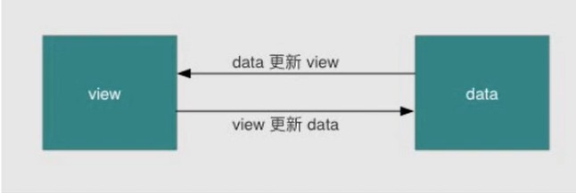

#### 1、​[html/css] [rem、em、vw、vh、px]()

- rem是一个长度单位

- px：绝对长度单位，最常用

- em，相对长度单位，相对于父元素，不常用

- rem ，相对长度单位，相对于根元素，常用于响应式布局

- 响应式布局常用的方案

  - media-query，（媒体查询）根据不同的屏幕宽度设置根元素font-size
  - rem，基于根元素的相对单位

- ##### media query

  ```html
  <!DOCTYPE html>
  <html lang="en">
  <head>
      <meta charset="UTF-8">
      <meta name="viewport" content="width=device-width, initial-scale=1.0">
      <title>media-query</title>
      <style>
          @media  only screen and (max-width: 374px) {
              /* iphone5 或者更小的尺寸 以iphone5 width320px 比例设置font-size */
              html{
                  font-size: 86px;
              }
          }
          @media  only screen and (min-width:375px) and (max-width: 413px) {
              /* iphone 678 以及iphone X*/
              html{
                  font-size: 100px;
              }
          }
          @media  only screen and (min-width: 414px) {
              /* iphone6p 或者更大的尺寸 以iphone5 width414px 比例设置font-size */
              html{
                  font-size: 110px;
              }
          }
          body {
              font-size:0.16rem;
          }
      </style>
  </head>
  <body>
      <div id="div1">
          this is a div
      </div>
  </body>
  </html>
  ```

  ##### vw/vh

  - rem的弊端：”阶梯性“

  - 网页视口尺寸

    window.screen.height 屏幕高度 667

    window.innerHeight 网页视口高度 553

    document.body.clientHeight:body的高度

  - vw/vh（也可以实现响应式布局）

    - vh：网页视口高度的1/100
    - vw:网页视口宽度的1/100
    - vmanx：取两者（vh和vw）最大值，vmin取两者最小值

#### 2、[js] [详述js new操作]()

- 利用构造函数创建对象

  - 因为上面的对象创建方法一次只能创建一个对象,里面有很多属性和方法是大量相同的,我们只能复制

  - 因此我们可以利用函数的方法  重复这些相同的代码 我们就把这个函数称为构造函数

  - 构造函数

    - 构造函数：是一种特殊的函数，主要用来初始化对象，即为对象成员变量赋初始值，它总与 new 运算符一起使用。我们可以把对象中一些公共的属性和方法抽取出来，然后封装到这个函数里面。

    - 构造函数的封装格式：

      ```js
      //
      function 构造函数名() {
           this.属性名= 值;
           this.方法名 = function(){};
      }
      new 构造函数名();
      
      function 构造函数名(形参1,形参2,形参3) {
             this.属性名1 = 参数1;
           this.属性名2 = 参数2;
             this.属性名3 = 参数3;
             this.方法名 = 函数体;
        }
      
      function Star(uname,age,sex){
            this.name=uname;
          this.age = age;
            this.sex=sex;
      }
        var ldh = new Star('刘德华',18,'男')
        console.log(ldh.name)
      ```

  - 构造函数的调用格式

    ```
      var obj = new 构造函数名(实参1，实参2，实参3)
    ```

    以上代码中，obj即接收到构造函数创建出来的对象。

    - 注意事项

      1.   构造函数约定**首字母大写**。
      2.   函数内的属性和方法前面需要添加 **this** ，表示当前对象的属性和方法。
      3.   构造函数中**不需要 return 返回结果**。
      4.   当我们创建对象的时候，**必须用 new 来调用构造函数**。

    - 其他

      构造函数，如 Stars()，抽象了对象的公共部分，封装到了函数里面，它泛指某一大类（class）  
      创建对象，如 new Stars()，特指某一个，通过 new 关键字创建对象的过程我们也称为对象实例化

- new关键字的作用 

  1. 在构造函数代码开始执行之前，创建一个空对象；
  2. 修改this的指向，把this指向创建出来的空对象；
  3. 执行函数的代码
  4. 在函数完成之后，返回this---即创建出来的对象

   - 为什么构造函数不需要return
     - 因为new 给我们返回了

#### 3、[计算机网络] [http状态码、其中303、304代表什么]()  

**什么是HTTP状态码**

**HTTP状态码**是服务端返回给客户端（因为这里是web开发，这里的客户端指浏览器客户端）的`3位数字代码`。

这些状态码相当于浏览器和服务器之间的对话信息。它们相互沟通两者之间的事情是正常运行了还是运行失败了或者发生了一些其他的事情（如Continue）。了解状态码有助于你快速的诊断错误，减少网站的停机时间等等。

**状态码分类**

状态码共分为五类，以1-5数字开头进行标识，如下：

- **1xxs - 信息性**：服务器正在处理请求。
- **2xxs - 成功信息**：请求已经完成，服务器向浏览器提供了预期的响应。
- **3xxs –重定向**：你的请求被重定向到了其他地方。服务器收到了请求，但是有某种重定向。
- **4xxs – 客户端错误**：客户端发生错误，导致服务器无法处理请求。
- **5xxs – 服务端错误**：客户端发出了有效的请求，但是服务器未能正确处理请求。

> 备注：3xxs类中的304是个奇葩，其不属于重定向信息提示，这个后面会讲到

**HTTP状态码**大体的内容已经了解了，但是在具体的工作中，要用到具体的状态码，我们下面来展开说明下各自的一些状态码和工作中常用到的那些状态码🐱

**1xxs状态码**

- **100 Continue**：表明目前为止，所有的请求内容都是可行的，客户端应该继续请求，如果完成，则忽略它。
- **101 Switching Protocol**：该状态码是响应客户端`Upgrade`标头发送的，并且指示服务器也正在切换协议。
- **103 Early Hints**：主要用于与`Link`链接头一起使用，以允许用户代理在服务器仍在准备响应时开始预加载资源。

> 备注：在web开发的工作中，我们都会使用封装好的库进行接口请求，而且浏览器的控制台网络中也不会出现这类状态码的提示（我没看到过😢），所以这一大类基本不会接触到，了解一下即可。

**2xxs状态码**

- 200 OK

  ：请求成功。成功的含义取决于HTTP方法：

  - `GET`：资源已被提取并在消息正文中传输。
  - `HEAD`：实体标头位于消息正文中。
  - `POST`：描述动作结果的资源在消息体中传输。
  - `TRACE`：消息正文包含服务器收到的请求信息。（方法不安全，一般不用）

说到了HTTP的方法，可以戳[HTTP请求方法](https://www.runoob.com/http/http-methods.html)这个解析教程来了解一下。

- **201 Created**：请求已经成功，并因此创建了一个新的资源。这通常是在`PUT`或`POST`请求之后发送的响应。
- **202 Accepted**：请求已经接收到，但是没有响应，没有结果。意味着不会有一个异步的响应去表明当前请求的结果，预期另外的进程和服务去处理请求，或者批处理。
- **204 No Content**：服务器成功处理了请求，但不需要返回任何实体内容，并且希望返回更新了的元信息。遇到`复杂请求`时候，浏览器会发送一个`OPTION`方法进行预处理返回响应。

关于复杂请求和简单请求，可以参考这篇文章[CORS非简单请求](https://mabiao8023.github.io/2018/03/30/CORS非简单请求/)。

- **205 Reset Content**：服务器已经成功处理了请求，但是没有返回任何内容。与204响应不同，返回此状态码的响应要求请求者重置文档视图。

> 备注：使用的最多的2xxs状态码是200和204，在遇到204状态码的时候，要注意一下自己发的请求是不是复杂请求。如果是复杂请求，那么在得到204返回时，浏览器有没有接受了这个请求的返回，如果没有，要叫后端搞下相关配置了。

**3xxs状态码**

上文已经提到过，这一大类是提示`重定向`，可是有一个奇葩--304，它并不是表示重定向的信息提示，而是表示`资源未被更改`。至于为什么会被放在这个分类里面，真不知道～（看官知道的话补充下啦）👏

- **301 Moved Permanently**：被请求的资源已`永久`移动到新位置，并且将来任何对此资源的引用都应该使用响应返回的若干个URI之一。
- **302 Found(Previously "Moved temporarily")**：请求的资源现在`临时`从不同的URI响应请求。由于这样的重定向是临时的，客户端应当继续向原有地址发送以后的请求。只有在`Cache-Control`或`Expires`中进行了指定的情况下，这个响应才是可缓存的。
- **303 See Other**：对当前的请求的响应可以在另一个URI上被找到，而且客户端应该采用`GET`的方式访问那个链接。这个方法的存在主要是为了允许由脚本激活的POST请求输出重定向到一个新的资源。
- **304 Not Modified**：如果客户端发送了一个带条件的 GET 请求且该请求已被允许，而文档的内容（自上次访问以来或者根据请求的条件）并没有改变，则服务器应当返回这个状态码。304 响应禁止包含消息体，因此始终以消息头后的第一个空行结尾。请求的时候一般结合`If-Modified-Since`头部使用。
- **307 Temporary Redirect**：307的意义如上302。与历史上302不同的是`在重新发出原始请求时不允许更改请求方法`。比如，使用POST请求始终就该用POST请求。

> 备注：307和303已经替代了历史上的302状态码，现在看到的临时重定向的状态码是307。详细内容可到维基百科上查看。

**4xxs状态码**

- **401 Unauthorized**：这意味着你的登录凭证无效。服务器不知道你是谁，这时，你需要尝试重新登录。
- **403 Forbidden**：服务器已经理解请求，但是拒绝执行它。与401不同，403知道是你登录了，但是还是拒绝了你。
- **404 Not Found**：请求失败，你请求所希望得到的资源未在服务器上发现。
- **410 Gone**：被请求的资源在服务器上已经不再可用，而且没有任何已知的转发地址。
- **422 Unprocessable Entity**：请求格式良好，但是由于语义错误而无妨遵循。这时候要检查下自己的传参格式语义有没有正确了。
- **429 Too Many Requests**：用户在给定的时间内发送了太多请求（“限制请求速率”）。在DDOS攻击中就可以使用到了。

> 备注：这里要注意的是422，别请求链接一出错，就屁颠屁颠的找后端，先看下后端给过来的API文档中，要传的字段是否都准确跟上了。😂

**5xxs状态码**

- **500 Internal Server Error**：服务器内部错误，服务器遇到了不知道如何处理的情况。比如后端同学写错了model啥的～
- **503 Service Unavailable**：服务器没有准备好处理请求。常见的原因是服务器因维护或重载而停机。
- **504 Gateway Timeout**：网关超时，服务器未能快速的做出反应。请求接口返回pedding时间过长基本就是这个问题了，囧。

> 备注：遇到这类的问题，去问后端同学吧。语气好点啦，毕竟大家都是为了生活😄

#### 4、[操作系统] [死锁的原理和四要素]()

**死锁条件**

死锁：一组互相竞争资源的线程因互相等待，导致“永久”阻塞的现象。

满足死锁的四个条件：
 1.互斥，共享资源 X 和 Y 只能被一个线程占用
 2.占有且等待，线程 T1 已经取得共享资源 X，在等待共享资源Y的时候，不释放共享资源 X；
 3.不可抢占，其他线程不能强行抢占线程 T1占有的资源,因为不可抢占，所以要等待;
 4.循环等待，线程T1等待线程T2占有的资源，线程T2等待线程T1占有的资源，就是循环等待。

这四个条件同时满足时，才会发生死锁，因此避免死锁只要打破其中一个条件则可。

**避免死锁方法**

1.对于互斥这个条件无法破坏，因为使用锁为的就是互斥。
 2.对于占有且等待，可以同时获取要使用的多个资源锁X和Y，这样就不会存在取得了X还要等待Y。这种方式只在需要获取的资源锁较少的情况下使用，如果要获取的资源锁很多（例如10个），就不太可行。
 3.对于不可抢占，可以获取了部分资源，再进一步获取其他资源时如果获取不到时，把已经获取的资源一起释放掉。此时意味着操作不能按照预期处理，需要考虑异常如何处理，例如是否需要重试。
 4.对于循环等待，可以将需要获取的锁资源排序，按照顺序获取，这样就不会多个线程交叉获取相同的资源导致死锁，而是在获取相同的资源时就等待，直到它释放。

#### 5、[Vue] [双向数据绑定原理]

- 什么是双向数据绑定
  - 数据变化更新视图，视图变化更新数据



输入框内容变化的时候，data中的数据同步变化 view=>model

data中的数据变化时，文本节点的内容同步变化 model=>view

>设计思想：观察者模式

- 发布者-订阅者模式：一般通过subject、pub的方式实现数据和视图的绑定监听，更新数据方式通常做法是 vm.set('property', value)

- 数据挟持：vue.js 采用数据挟持结合发布者-订阅者模式的方法，通过 Object.defineProperty() 来挟持各个属性的 setter、getter，在数据变动时发布消息给订阅者，触发相应的监听回调。

- 数据挟持的思路：

  1. 利用 Proxy 或者 Object.defineProperty 生成的 Observer 针对对象/对象的属性进行“挟持”，在属性发生变化后通知订阅者
  2. 解析器 Compile 解析模板中的 Directive，收集指令所依赖的方法和数据，等待数据变化，然后渲染
  3. Watcher 属于 Observer 和 Compile 桥梁，它将收到的 Observer 产生的变化，并根据 Compile 童工的指令进行视图渲染，使数据变化促使视图变化

  - Dep对象：Dependency依赖的简写，包含有三个主要属性id,subs，target和四个主要函数addSub,removeSub，depend，notify是观察者的依赖集合，负责在数据发生改变的时候，使用notify触发保存在subs下的订阅列表，依次更新数据和DOM。
  - observer对象:即观察者，包含两个主要属性value，dep 做法是使用getter/setter 方法覆盖默认的取值和赋值操作，将对象封装为响应式对象，每一次调用时更新依赖列表，更新值时触发订阅者。绑定在对象的_ob_原型链属性上。

  **实现 mvvm 的双向绑定必要因素**

  实现 mvvm 的双向绑定，必须要实现以下几点：

  - 实现一个数据监听器 Observer，能够对数据对象的所有属性进行监听，如有变动可拿到最新值并通知订阅者
  - 实现一个指令解析器 Compile，对每个元素节点的指令进行扫描和解析，根据指令模版替换数据，以绑定相应的更新函数
  - 实现一个 watcher，作为 compile 和 observer 的桥梁，能够订阅并收到每个属性变动的通知，执行指令绑定的相应回调函数，从而更新视图。
  - mvvm的入口函数，整合上面三者

  

  #### 实现 observer

  observer需要具备的功能：1.监听数据变化 2.数据变化通知订阅者

  Object.defineProperty() 来监听属性变动，那么将需要 observe 的数据对象进行递归遍历，包括子属性对象的属性，都加上 setter 和 getter。

  ```
  var data = {name: 'xiaohui'};
  observe(data);
  data.name = 'test';
  
  function observe(data) {
  	if(!data || typeof data !== 'object') {
      	return;
      }
      Object.keys(data).forEach((key) => defineReactive(data, key，data[key]))
  }
  function defineReactive(data, key, val) {
  	observe(val) // 监听子属性
      Object.defineProperty(data, key, {
      	enumberable: true,
          configurable: false,
          get: function() {
          	return val;
          },
          set: function(newVal) {
          	console.log(`监听到值变了！${val} ----> ${newVal}`)
              val = newVal;
          }
      })
  }
  复制代码
  ```

  此时，我们就可以监听每个数据的变化了，监听之后怎么通知订阅者，就需要实现一个消息订阅器，也就是维护一个数组，用来收集订阅者，数据变动触发 notify，再调用订阅者的 update 方法

  ```
  function defineReactive(data, key, val) {
  	var dep = new Dep();
      observe(val);
      Object.defineProperty(data, key, {
      	// 省略
          set: function(newVal) {
          	if(val === newVal) {
              	return;
              }
              val = newVal;
              dep.notify(); //通知所有订阅者
          }
      })
  }
  function Dep() {
  	this.subs = [];
  }
  Dep.prototype = {
  	addSub: function(sub) {
      	this.subs.push(sub)
      },
      notify: function() {
      	this.subs.forEach(sub => {
          	sub.update();
          })
      }
  }
  复制代码
  ```

  此时我们的问题就来了，订阅者是 watcher，那怎么往 subs 里添加订阅者呢？通过 dep 添加订阅者，就必须要在闭包内操作

  ```
  Object.defineProperty(data, key, {
  	get: function() {
      	// 通过 Dep 定义一个全局 target 属性，暂存 watcher，用完移除
      	Dep.target && dep.addDep(Dep.target)
          return val;
      }
  })
  Watcher。prototype = {
  	get: function(key) {
      	Dep.target = this;
          this.value = data[key] // 会触发getter，从而添加订阅者
          Dep.target = null
      }
  }
  
  复制代码
  ```

  #### 实现 Compile

  Compile 主要是解析模版指令，将模版中的变量替换成数据，然后初始化渲染页面视图，并经每个指令对应的节点绑定更新函数函数，添加监听数据的订阅者，一旦有数据变动，收到通知，更新视图。

  ```
  // 遍历解析过程中，会多次操作 dom，为了提高性能和效率，会将 vue 实例根结点的 el 转换成 文档碎片 fragment，进行解析编译操作，解析完成，再将 fragment 添加回原来的真实 dom 节点中。
  
  function Compile(el) {
  	this.$el = this.isElementNode(el) ? el : doucment.querySelector(el);
      if (this.$el) {
      	this.$fragment = this.node2Fragment(this.$el);
          this.init();
          this.$el.appendChild(thiis.$fragment);
      }
  }
  Compile.prototype = {
  	init: function() {
      	this.compileElement(this.$fragment);
      },
      node2Fragment: function() {
      	var fragment = document.createDocumentFragment();
          var child = el.firstChild;
          // 将原生节点拷贝到fragment
          while (child) {
          	fragment.appendChild(child)
          }
          return fragment;
      },
      // 遍历所有节点以及子节点，进行扫描解析编译，调用对应的指令渲染函数进行数据渲染，并调用对应的指令更新函数进行绑定。
      compileElement: function(el) {
      	var childNodes = el.childNodes, me = this;
          [].slice.call(childNodes).forEach(node => {
          	var text = node.textContext;
              var reg = /\{\{(.*)\}\}/;
              if (me.isElementNode(node)) {
              	me.compile(node)
              } else if (me.isTextnode(node) && reg.test(text)) {
              	me.compileText(node, RegExp.$1)
              }
              if (node.childNodes && node.childNodes.length) {
              	me.compileElement(node)
              }
          })
      },
      compile: function(node) {
      	var nodeAttrs = node.attributes, me = this;
          [].slice.call(nodeAttrs).forEach(attr => {
          	var attrName = attr.name;
              if(me.isDirective(attrName)) {
              	var exp = attr.value
                  // 指令以 v-xxx 命名
                  var dir = attrName.subString(2)
                  if (me.isEventDirective(dir)) {
                  	compileUtil.eventHandler(node, me.$vm, exp, dir)
                  } else {
                  	compileUtil[dir] && compileUtil[dir](node, me.$vm, exp)
                  }
              }
          })
      }
  }
  var compileUtil = {
  	text: function(node, vm. exp) {
      	this.bind(node, vm, exp, 'text')
      },
      bind: function(node, vm, exp, dir) {
      	var updateFn = updater[dir + 'Updater'];
          updaterFn && updateFn(node, vm[exp]);
          new Watcher(vm, exp, function(value, oldValue) {
          	updaterFn && updaterFn(node, value, oldValue);
          })
      }
  }
  var updater = {
  	textUpdater: function(node, value) {
      	node.textContent = typeof value === 'undefined' ? '' : value;
      }
  }
  复制代码
  ```

  #### 实现 Watcher

  watcher 订阅者作为 Observer 和 Compile 之间通信的桥梁，主要做的事情是：

  1. 在自身实例化时往属性订阅器（dep）里面添加自己
  2. 自身必须有一个 update() 方法
  3. 待属性变动，dep.notify() 通知时，能调用自身的 update() 方法，并触发 Compile 中绑定的回调

  ```
  function Watcher(vm, exp, cb) {
  	this.cb = cb;
      this.vm = vm;
      this.exp = exp;
      this.value = this.get();
  }
  Watcher.prototype = {
  	update: function() {
      	this.run();
      },
      run: function() {
      	var value = this.get();
          var oldValue = this.value;
          if (value !== oldValue) {
          	this.value = value;
              this.cb.call(this.vm, value, oldVal) // 执行 Compile 中绑定的回调，更新视图
          }
      }，
      get: function() {
      	Dep.target = this; // 将当前订阅者指向自己
          var value = this.vm[exp]; // 触发 getter，添加自己到属性订阅起中
          Dep.target = null; //添加完毕，重置
          return value;
      }
  }
  复制代码
  ```

  #### 实现MVVM

  MVVM 作为数据绑定的入口，整合 Observer、Compile 和 Watcher 三者，通过 Observer 来监听自己的 model 数据变化，通过 Compile 来解析编译模版指令，最终利用 Watcher 搭起 Oberver 和 Compile 之间的桥梁，达到数据变化 -> 视图更新；视图交互变化 -> 数据model 变更的双向绑定效果。

  ```
  function MVVM (options) {
  	this.$options = options;
      var data = this._data = this.$options.data, me = this;
      Object.keys(data).forEach(key => me._proxy(key))
      observe(data, this)
      this.$compile = new Compile(options.el || document.body, this)
  }
  MVVM.prototype = { 
  	_proxy: function(key) {
      	var me = this;
          Object.defineProperty(me, key, {
          	configurable: false,
              enumerable: true,
              get: function proxyGetter() {
                  return me._data[key];
              },
              set: function proxySetter(newVal) {
                  me._data[key] = newVal;
              }
          })
      }
      
  }
  复制代码
  ```

  ### Object.defineProperty 和 proxy 区别

  Object.defineProperty的缺陷：

  - 不能监听数组变化
  - 只能劫持对象的属性，属性值如果也是对象，需要深度遍历

  Proxy 就是在被劫持的对象之前加了一层拦截，它的特性是：

  - 可以直接监听对象，而非属性
  - 可以直接监听数组的变化
  - proxy 返回一个新对象，我们可以只操作新对象达到目的，而 Object.defineProperty 只能遍历对象属性直接修改
  - 劣势是浏览器的兼容性问题，所以vue 3.0 才会用 Proxy 重写

  总之，defineProperty 是劫持对象的属性，当新增属性时，需要重新劫持。proxy 是代理对象，所有的对象属性变更都能访问到，对于目前defineProperty 所存在的问题，都能提供完美的解决方案

  ### Vue2.x 中数组和对象观察时的特殊处理

  Vue 2.0 中响应式数据是通过 defineProperty 实现，因此无法检测数组/对象的新增和删除，当调用数组的push、splice、pop 等方法改变数组元素时，并不会触发数组的 setter，所以，Vue 2.0 做了一些特殊处理，使用函数挟持的方式，重写了数组的方法，vue 将 data 中的数组进行原型链重写，指向自己定义的数组原型方法。这样当调用数组的 api 时，可以通知依赖更新。如果数组中包含引用类型，会对数组中的引用类型再次递归遍历进行监控。

  至于目前存在的“无法通过索引改变数组”的问题，是因为性能问题，性能代价和获得的用户体验收益不成正比

#### 6、[浏览器/Nodejs/Webpack] [跨域是什么，如何解决跨域，为什么禁止跨域]() 

- 前言

前后端数据交互经常会碰到请求跨域，什么是跨域，以及有哪几种跨域方式，这是本文要探讨的内容。

**本文完整的源代码请猛戳[github博客](https://github.com/ljianshu/Blog)，纸上得来终觉浅，建议动手敲敲代码**

一、什么是跨域？

**1.什么是同源策略及其限制内容？**

同源策略是一种约定，它是浏览器最核心也最基本的安全功能，如果缺少了同源策略，浏览器很容易受到XSS、CSRF等攻击。所谓同源是指"协议+域名+端口"三者相同，即便两个不同的域名指向同一个ip地址，也非同源。

**同源策略限制内容有：**

- Cookie、LocalStorage、IndexedDB 等存储性内容
- DOM 节点
- AJAX 请求发送后，结果被浏览器拦截了

但是有三个标签是允许跨域加载资源：

- ``
- ``
- ``

2.常见跨域场景

**当协议、子域名、主域名、端口号中任意一个不相同时，都算作不同域**。不同域之间相互请求资源，就算作“跨域”。常见跨域场景如下图所示：


特别说明两点：

**第一：如果是协议和端口造成的跨域问题“前台”是无能为力的。**

**第二：在跨域问题上，仅仅是通过“URL的首部”来识别而不会根据域名对应的IP地址是否相同来判断。“URL的首部”可以理解为“协议, 域名和端口必须匹配”**。

这里你或许有个疑问：**请求跨域了，那么请求到底发出去没有？**

**跨域并不是请求发不出去，请求能发出去，服务端能收到请求并正常返回结果，只是结果被浏览器拦截了**。你可能会疑问明明通过表单的方式可以发起跨域请求，为什么 Ajax 就不会?因为归根结底，跨域是为了阻止用户读取到另一个域名下的内容，Ajax 可以获取响应，浏览器认为这不安全，所以拦截了响应。但是表单并不会获取新的内容，所以可以发起跨域请求。同时也说明了跨域并不能完全阻止 CSRF，因为请求毕竟是发出去了。

二、跨域解决方案

1.jsonp

1) JSONP原理

**利用 `` 标签没有跨域限制的漏洞，网页可以得到从其他来源动态产生的 JSON 数据。JSONP请求一定需要对方的服务器做支持才可以。**

2) JSONP和AJAX对比

JSONP和AJAX相同，都是客户端向服务器端发送请求，从服务器端获取数据的方式。但AJAX属于同源策略，JSONP属于非同源策略（跨域请求）

3) JSONP优缺点

JSONP优点是简单兼容性好，可用于解决主流浏览器的跨域数据访问的问题。**缺点是仅支持get方法具有局限性,不安全可能会遭受XSS攻击。**

4) JSONP的实现流程

- 声明一个回调函数，其函数名(如show)当做参数值，要传递给跨域请求数据的服务器，函数形参为要获取目标数据(服务器返回的data)。
- 创建一个``标签，把那个跨域的API数据接口地址，赋值给script的src,还要在这个地址中向服务器传递该函数名（可以通过问号传参:?callback=show）。
- 服务器接收到请求后，需要进行特殊的处理：把传递进来的函数名和它需要给你的数据拼接成一个字符串,例如：传递进去的函数名是show，它准备好的数据是`show('我不爱你')`。
- 最后服务器把准备的数据通过HTTP协议返回给客户端，客户端再调用执行之前声明的回调函数（show），对返回的数据进行操作。

在开发中可能会遇到多个 JSONP 请求的回调函数名是相同的，这时候就需要自己封装一个 JSONP函数。

```
// index.html
function jsonp({ url, params, callback }) {
  return new Promise((resolve, reject) => {
    let script = document.createElement('script')
    window[callback] = function(data) {
      resolve(data)
      document.body.removeChild(script)
    }
    params = { ...params, callback } // wd=b&callback=show
    let arrs = []
    for (let key in params) {
      arrs.push(`${key}=${params[key]}`)
    }
    script.src = `${url}?${arrs.join('&')}`
    document.body.appendChild(script)
  })
}
jsonp({
  url: 'http://localhost:3000/say',
  params: { wd: 'Iloveyou' },
  callback: 'show'
}).then(data => {
  console.log(data)
})
```

上面这段代码相当于向`http://localhost:3000/say?wd=Iloveyou&callback=show`这个地址请求数据，然后后台返回`show('我不爱你')`，最后会运行show()这个函数，打印出'我不爱你'

```
// server.js
let express = require('express')
let app = express()
app.get('/say', function(req, res) {
  let { wd, callback } = req.query
  console.log(wd) // Iloveyou
  console.log(callback) // show
  res.end(`${callback}('我不爱你')`)
})
app.listen(3000)
```

5) jQuery的jsonp形式

**JSONP都是GET和异步请求的，不存在其他的请求方式和同步请求，且jQuery默认就会给JSONP的请求清除缓存。**

```
$.ajax({
url:"http://crossdomain.com/jsonServerResponse",
dataType:"jsonp",
type:"get",//可以省略
jsonpCallback:"show",//->自定义传递给服务器的函数名，而不是使用jQuery自动生成的，可省略
jsonp:"callback",//->把传递函数名的那个形参callback，可省略
success:function (data){
console.log(data);}
});
```

2.cors

**CORS 需要浏览器和后端同时支持。IE 8 和 9 需要通过 XDomainRequest 来实现**。

浏览器会自动进行 CORS 通信，实现 CORS 通信的关键是后端。只要后端实现了 CORS，就实现了跨域。

服务端设置 Access-Control-Allow-Origin 就可以开启 CORS。 该属性表示哪些域名可以访问资源，如果设置通配符则表示所有网站都可以访问资源。

虽然设置 CORS 和前端没什么关系，但是通过这种方式解决跨域问题的话，会在发送请求时出现两种情况，分别为**简单请求**和**复杂请求**。

1) 简单请求

只要同时满足以下两大条件，就属于简单请求

条件1：使用下列方法之一：

- GET
- HEAD
- POST

条件2：Content-Type 的值仅限于下列三者之一：

- text/plain
- multipart/form-data
- application/x-www-form-urlencoded

请求中的任意 XMLHttpRequestUpload 对象均没有注册任何事件监听器； XMLHttpRequestUpload 对象可以使用 XMLHttpRequest.upload 属性访问。

2) 复杂请求

不符合以上条件的请求就肯定是复杂请求了。
复杂请求的CORS请求，会在正式通信之前，增加一次HTTP查询请求，称为"预检"请求,该请求是 option 方法的，通过该请求来知道服务端是否允许跨域请求。

我们用`PUT`向后台请求时，属于复杂请求，后台需做如下配置：

```
// 允许哪个方法访问我
res.setHeader('Access-Control-Allow-Methods', 'PUT')
// 预检的存活时间
res.setHeader('Access-Control-Max-Age', 6)
// OPTIONS请求不做任何处理
if (req.method === 'OPTIONS') {
  res.end() 
}
// 定义后台返回的内容
app.put('/getData', function(req, res) {
  console.log(req.headers)
  res.end('我不爱你')
})
```

接下来我们看下一个完整复杂请求的例子，并且介绍下CORS请求相关的字段

```
// index.html
let xhr = new XMLHttpRequest()
document.cookie = 'name=xiamen' // cookie不能跨域
xhr.withCredentials = true // 前端设置是否带cookie
xhr.open('PUT', 'http://localhost:4000/getData', true)
xhr.setRequestHeader('name', 'xiamen')
xhr.onreadystatechange = function() {
  if (xhr.readyState === 4) {
    if ((xhr.status >= 200 && xhr.status < 300) || xhr.status === 304) {
      console.log(xhr.response)
      //得到响应头，后台需设置Access-Control-Expose-Headers
      console.log(xhr.getResponseHeader('name'))
    }
  }
}
xhr.send()
//server1.js
let express = require('express');
let app = express();
app.use(express.static(__dirname));
app.listen(3000);
//server2.js
let express = require('express')
let app = express()
let whitList = ['http://localhost:3000'] //设置白名单
app.use(function(req, res, next) {
  let origin = req.headers.origin
  if (whitList.includes(origin)) {
    // 设置哪个源可以访问我
    res.setHeader('Access-Control-Allow-Origin', origin)
    // 允许携带哪个头访问我
    res.setHeader('Access-Control-Allow-Headers', 'name')
    // 允许哪个方法访问我
    res.setHeader('Access-Control-Allow-Methods', 'PUT')
    // 允许携带cookie
    res.setHeader('Access-Control-Allow-Credentials', true)
    // 预检的存活时间
    res.setHeader('Access-Control-Max-Age', 6)
    // 允许返回的头
    res.setHeader('Access-Control-Expose-Headers', 'name')
    if (req.method === 'OPTIONS') {
      res.end() // OPTIONS请求不做任何处理
    }
  }
  next()
})
app.put('/getData', function(req, res) {
  console.log(req.headers)
  res.setHeader('name', 'jw') //返回一个响应头，后台需设置
  res.end('我不爱你')
})
app.get('/getData', function(req, res) {
  console.log(req.headers)
  res.end('我不爱你')
})
app.use(express.static(__dirname))
app.listen(4000)
```

上述代码由`http://localhost:3000/index.html`向`http://localhost:4000/`跨域请求，正如我们上面所说的，后端是实现 CORS 通信的关键。

3.postMessage

postMessage是HTML5 XMLHttpRequest Level 2中的API，且是为数不多可以跨域操作的window属性之一，它可用于解决以下方面的问题：

- 页面和其打开的新窗口的数据传递
- 多窗口之间消息传递
- 页面与嵌套的iframe消息传递
- 上面三个场景的跨域数据传递

**postMessage()方法允许来自不同源的脚本采用异步方式进行有限的通信，可以实现跨文本档、多窗口、跨域消息传递**。

> otherWindow.postMessage(message, targetOrigin, [transfer]);

- message: 将要发送到其他 window的数据。
- targetOrigin:通过窗口的origin属性来指定哪些窗口能接收到消息事件，其值可以是字符串"*"（表示无限制）或者一个URI。在发送消息的时候，如果目标窗口的协议、主机地址或端口这三者的任意一项不匹配targetOrigin提供的值，那么消息就不会被发送；只有三者完全匹配，消息才会被发送。
- transfer(可选)：是一串和message 同时传递的 Transferable 对象. 这些对象的所有权将被转移给消息的接收方，而发送一方将不再保有所有权。

接下来我们看个例子： `http://localhost:3000/a.html`页面向`http://localhost:4000/b.html`传递“我爱你”,然后后者传回"我不爱你"。

```html
// a.html
  <iframe src="http://localhost:4000/b.html" frameborder="0" id="frame" onload="load()"></iframe> //等它加载完触发一个事件
  //内嵌在http://localhost:3000/a.html
    <script>
      function load() {
        let frame = document.getElementById('frame')
        frame.contentWindow.postMessage('我爱你', 'http://localhost:4000') //发送数据
        window.onmessage = function(e) { //接受返回数据
          console.log(e.data) //我不爱你
        }
      }
    </script>
// b.html
  window.onmessage = function(e) {
    console.log(e.data) //我爱你
    e.source.postMessage('我不爱你', e.origin)
 }
```

4.websocket

Websocket是HTML5的一个持久化的协议，它实现了浏览器与服务器的全双工通信，同时也是跨域的一种解决方案。WebSocket和HTTP都是应用层协议，都基于 TCP 协议。但是 **WebSocket 是一种双向通信协议，在建立连接之后，WebSocket 的 server 与 client 都能主动向对方发送或接收数据**。同时，WebSocket 在建立连接时需要借助 HTTP 协议，连接建立好了之后 client 与 server 之间的双向通信就与 HTTP 无关了。

原生WebSocket API使用起来不太方便，我们使用`Socket.io`，它很好地封装了webSocket接口，提供了更简单、灵活的接口，也对不支持webSocket的浏览器提供了向下兼容。

我们先来看个例子：本地文件socket.html向`localhost:3000`发生数据和接受数据

```
// socket.html
<script>
    let socket = new WebSocket('ws://localhost:3000');
    socket.onopen = function () {
      socket.send('我爱你');//向服务器发送数据
    }
    socket.onmessage = function (e) {
      console.log(e.data);//接收服务器返回的数据
    }
</script>
// server.js
let express = require('express');
let app = express();
let WebSocket = require('ws');//记得安装ws
let wss = new WebSocket.Server({port:3000});
wss.on('connection',function(ws) {
  ws.on('message', function (data) {
    console.log(data);
    ws.send('我不爱你')
  });
})
```

5. Node中间件代理(两次跨域)

实现原理：**同源策略是浏览器需要遵循的标准，而如果是服务器向服务器请求就无需遵循同源策略。**
代理服务器，需要做以下几个步骤：

- 接受客户端请求 。
- 将请求 转发给服务器。
- 拿到服务器 响应 数据。
- 将 响应 转发给客户端。


我们先来看个例子：本地文件index.html文件，通过代理服务器`http://localhost:3000`向目标服务器`http://localhost:4000`请求数据。

```
// index.html(http://127.0.0.1:5500)
 <script src="https://cdn.bootcss.com/jquery/3.3.1/jquery.min.js"></script>
    <script>
      $.ajax({
        url: 'http://localhost:3000',
        type: 'post',
        data: { name: 'xiamen', password: '123456' },
        contentType: 'application/json;charset=utf-8',
        success: function(result) {
          console.log(result) // {"title":"fontend","password":"123456"}
        },
        error: function(msg) {
          console.log(msg)
        }
      })
     </script>
// server1.js 代理服务器(http://localhost:3000)
const http = require('http')
// 第一步：接受客户端请求
const server = http.createServer((request, response) => {
  // 代理服务器，直接和浏览器直接交互，需要设置CORS 的首部字段
  response.writeHead(200, {
    'Access-Control-Allow-Origin': '*',
    'Access-Control-Allow-Methods': '*',
    'Access-Control-Allow-Headers': 'Content-Type'
  })
  // 第二步：将请求转发给服务器
  const proxyRequest = http
    .request(
      {
        host: '127.0.0.1',
        port: 4000,
        url: '/',
        method: request.method,
        headers: request.headers
      },
      serverResponse => {
        // 第三步：收到服务器的响应
        var body = ''
        serverResponse.on('data', chunk => {
          body += chunk
        })
        serverResponse.on('end', () => {
          console.log('The data is ' + body)
          // 第四步：将响应结果转发给浏览器
          response.end(body)
        })
      }
    )
    .end()
})
server.listen(3000, () => {
  console.log('The proxyServer is running at http://localhost:3000')
})
// server2.js(http://localhost:4000)
const http = require('http')
const data = { title: 'fontend', password: '123456' }
const server = http.createServer((request, response) => {
  if (request.url === '/') {
    response.end(JSON.stringify(data))
  }
})
server.listen(4000, () => {
  console.log('The server is running at http://localhost:4000')
})
```

上述代码经过两次跨域，值得注意的是浏览器向代理服务器发送请求，也遵循同源策略，最后在index.html文件打印出`{"title":"fontend","password":"123456"}`

6.nginx反向代理

实现原理类似于Node中间件代理，需要你搭建一个中转nginx服务器，用于转发请求。

使用nginx反向代理实现跨域，是最简单的跨域方式。只需要修改nginx的配置即可解决跨域问题，支持所有浏览器，支持session，不需要修改任何代码，并且不会影响服务器性能。

实现思路：通过nginx配置一个代理服务器（域名与domain1相同，端口不同）做跳板机，反向代理访问domain2接口，并且可以顺便修改cookie中domain信息，方便当前域cookie写入，实现跨域登录。

先下载[nginx](http://nginx.org/en/download.html)，然后将nginx目录下的nginx.conf修改如下:

```
// proxy服务器
server {
    listen       81;
    server_name  www.domain1.com;
    location / {
        proxy_pass   http://www.domain2.com:8080;  #反向代理
        proxy_cookie_domain www.domain2.com www.domain1.com; #修改cookie里域名
        index  index.html index.htm;

        # 当用webpack-dev-server等中间件代理接口访问nignx时，此时无浏览器参与，故没有同源限制，下面的跨域配置可不启用
        add_header Access-Control-Allow-Origin http://www.domain1.com;  #当前端只跨域不带cookie时，可为*
        add_header Access-Control-Allow-Credentials true;
    }
}
```

最后通过命令行`nginx -s reload`启动nginx

```
// index.html
var xhr = new XMLHttpRequest();
// 前端开关：浏览器是否读写cookie
xhr.withCredentials = true;
// 访问nginx中的代理服务器
xhr.open('get', 'http://www.domain1.com:81/?user=admin', true);
xhr.send();
// server.js
var http = require('http');
var server = http.createServer();
var qs = require('querystring');
server.on('request', function(req, res) {
    var params = qs.parse(req.url.substring(2));
    // 向前台写cookie
    res.writeHead(200, {
        'Set-Cookie': 'l=a123456;Path=/;Domain=www.domain2.com;HttpOnly'   // HttpOnly:脚本无法读取
    });
    res.write(JSON.stringify(params));
    res.end();
});
server.listen('8080');
console.log('Server is running at port 8080...');
```

7.window.name + iframe

window.name属性的独特之处：name值在不同的页面（甚至不同域名）加载后依旧存在，并且可以支持非常长的 name 值（2MB）。

其中a.html和b.html是同域的，都是`http://localhost:3000`;而c.html是`http://localhost:4000`

```
 // a.html(http://localhost:3000/b.html)
  <iframe src="http://localhost:4000/c.html" frameborder="0" onload="load()" id="iframe"></iframe>
  <script>
    let first = true
    // onload事件会触发2次，第1次加载跨域页，并留存数据于window.name
    function load() {
      if(first){
      // 第1次onload(跨域页)成功后，切换到同域代理页面
        let iframe = document.getElementById('iframe');
        iframe.src = 'http://localhost:3000/b.html';
        first = false;
      }else{
      // 第2次onload(同域b.html页)成功后，读取同域window.name中数据
        console.log(iframe.contentWindow.name);
      }
    }
  </script>
```

b.html为中间代理页，与a.html同域，内容为空。

```
 // c.html(http://localhost:4000/c.html)
  <script>
    window.name = '我不爱你'  
  </script>
```

总结：通过iframe的src属性由外域转向本地域，跨域数据即由iframe的window.name从外域传递到本地域。这个就巧妙地绕过了浏览器的跨域访问限制，但同时它又是安全操作。

8.location.hash + iframe

实现原理： a.html欲与c.html跨域相互通信，通过中间页b.html来实现。 三个页面，不同域之间利用iframe的location.hash传值，相同域之间直接js访问来通信。

具体实现步骤：一开始a.html给c.html传一个hash值，然后c.html收到hash值后，再把hash值传递给b.html，最后b.html将结果放到a.html的hash值中。
同样的，a.html和b.html是同域的，都是`http://localhost:3000`;而c.html是`http://localhost:4000`

```
 // a.html
  <iframe src="http://localhost:4000/c.html#iloveyou"></iframe>
  <script>
    window.onhashchange = function () { //检测hash的变化
      console.log(location.hash);
    }
  </script>
 // b.html
  <script>
    window.parent.parent.location.hash = location.hash 
    //b.html将结果放到a.html的hash值中，b.html可通过parent.parent访问a.html页面
  </script>
 // c.html
 console.log(location.hash);
  let iframe = document.createElement('iframe');
  iframe.src = 'http://localhost:3000/b.html#idontloveyou';
  document.body.appendChild(iframe);
```

9.document.domain + iframe

**该方式只能用于二级域名相同的情况下，比如 `a.test.com` 和 `b.test.com` 适用于该方式**。
只需要给页面添加 `document.domain ='test.com'` 表示二级域名都相同就可以实现跨域。

实现原理：两个页面都通过js强制设置document.domain为基础主域，就实现了同域。

我们看个例子：页面`a.zf1.cn:3000/a.html`获取页面`b.zf1.cn:3000/b.html`中a的值

```
// a.html
<body>
 helloa
  <iframe src="http://b.zf1.cn:3000/b.html" frameborder="0" onload="load()" id="frame"></iframe>
  <script>
    document.domain = 'zf1.cn'
    function load() {
      console.log(frame.contentWindow.a);
    }
  </script>
</body>
// b.html
<body>
   hellob
   <script>
     document.domain = 'zf1.cn'
     var a = 100;
   </script>
</body>
```

三、总结

- CORS支持所有类型的HTTP请求，是跨域HTTP请求的根本解决方案
- JSONP只支持GET请求，JSONP的优势在于支持老式浏览器，以及可以向不支持CORS的网站请求数据。
- 不管是Node中间件代理还是nginx反向代理，主要是通过同源策略对服务器不加限制。
- 日常工作中，用得比较多的跨域方案是cors和nginx反向代理

#### +1、[数据结构/算法] [LeetCode26、找一个数组中的重复元素并删除]()  

一、题目描述

给定一个排序数组，你需要在 原地 删除重复出现的元素，使得每个元素只出现一次，返回移除后数组的新长度。

不要使用额外的数组空间，你必须在 原地 修改输入数组 并在使用 O(1) 额外空间的条件下完成。

```
示例 1:

给定数组 nums = [1,1,2], 

函数应该返回新的长度 2, 并且原数组 nums 的前两个元素被修改为 1, 2。 

你不需要考虑数组中超出新长度后面的元素。
示例 2:

给定 nums = [0,0,1,1,1,2,2,3,3,4],

函数应该返回新的长度 5, 并且原数组 nums 的前五个元素被修改为 0, 1, 2, 3, 4。

你不需要考虑数组中超出新长度后面的元素。
复制代码
```

说明:

为什么返回数值是整数，但输出的答案是数组呢?

请注意，输入数组是以「引用」方式传递的，这意味着在函数里修改输入数组对于调用者是可见的。

你可以想象内部操作如下:

```
// nums 是以“引用”方式传递的。也就是说，不对实参做任何拷贝
int len = removeDuplicates(nums);

// 在函数里修改输入数组对于调用者是可见的。
// 根据你的函数返回的长度, 它会打印出数组中该长度范围内的所有元素。
for (int i = 0; i < len; i++) {
    print(nums[i]);
}
复制代码
```

二、思路分析

使用快慢指针来记录遍历的坐标，如果两个指针指的数字相同，则快指针向前走一步，如果不同，则两个指针都向前走一步，当快指针走完整个数组后，慢指针当前的坐标加1，就是数组中不同数字的个数。

实际上这就是双指针中的快慢指针。在这里快指针是读指针， 慢指针是写指针。


三、答案代码

```
/**
 * @param {number[]} nums
 * @return {number}
 */
var removeDuplicates = function (nums) {
  if (size == 0) return 0;
  let slowP = 0;
  for (let fastP = 0; fastP < nums.length; fastP++) {
    if (nums[fastP] !== nums[slowP]) {
      slowP++;
      nums[slowP] = nums[fastP];
    }
  }
  return slowP + 1;
};
```
